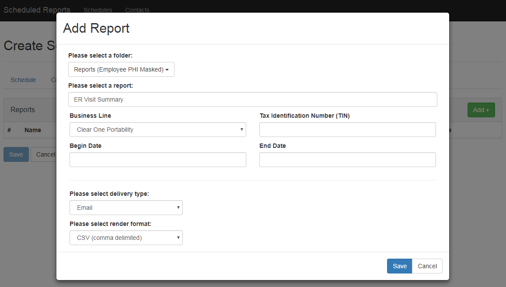

# Changelog - **VERSION**

**DATE** Kevin Stine <kevin.stine@pacificsource.com>

## Improvements/New Features

### Start & Date Times

Updated the handling of start & date times. Each will now be required in order
to prevent errors that arose when the use did not include a start/date time

### Report Delivery Handling

Moved the Delivery section out from it's own tab and into the report modal. This
will ensure that *each* report has it's own render format & file share path (if applicable).
Previously, there was just one set of Delivery options per schedule, now each report
will have it's own delivery options to allow for a wider range of scheduling options.

### Edit/Detail Page Formatting

Updated Edit/Details pages to be consistent with the new layout of the create page

### Input Field AutoFocus

Added some JavaScript to autofocus on certain input fields when a selection is
  made. This occurs when the user selects an option from a dropdown menu, and
  will automatically focus on the next element, if it's an input text field.

### Multi-Value Parameter Handling

Reworked the way parameters are handled to properly handle parameters that allow
for multiple options. This is implemented by using a dropdown list and adding
a checkbox for each parameter option.

___

## Bug Fixes

* Updated formatting for start date to include ':' for consistency

* Updated save button on reports page for consistency

___

## Other

* Cleaned up bits of unused and old code

___

Link to QA: <https://administrationqa/ReportScheduling>  
Corresponds to Release *{#}*: